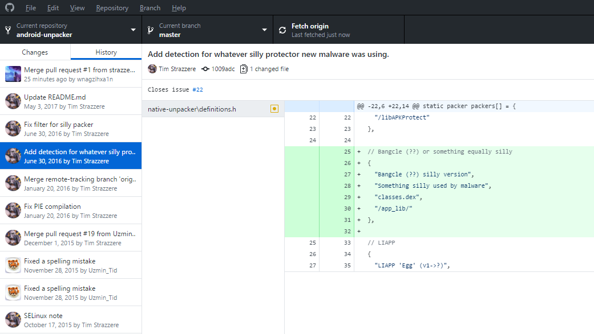

# 分析Strazzere-android-unpack脱壳工具源码

**Author：wnagzihxa1n
Mail：tudouboom@163.com**

这是DEF CON 22关于安卓应用加固脱壳的一个工具，2014年的，所以脱壳思想简单粗暴，并不适合目前的壳
- https://github.com/strazzere/android-unpacker

两年前作者把代码传到了Gayhub，之后又更新了一波



需要输入待脱壳应用的包名作为参数
```
printf("[ * ] Android Dalvik Unpacker/Unprotector -  < strazz@gmail.com > \n");
if (argc <= 0)
{
    printf(" [ ! ] Nothing to unpack, quitting\n");
    return 0;
}
```

获取当前用户的UID，确保有足够的权限做后续的操作
```
if (getuid() != 0)
{
    printf(" [ ! ] Not root, quitting\n");
    return -1;
}
```

通过包名获取待脱壳应用对应的PID
```
char *package_name = argv[1];
printf(" [ + ] Hunting for % s\n", package_name);
uint32_t pid = get_process_pid(package_name);
if (pid <= 0)
{
    printf(" [ ! ] Process could not be found ! \n");
    return -1;
}
printf(" [ + ] % d is service pid\n", pid);
```

获取PID
```
uint32_t get_process_pid(const char *target_package_name)
{
    char self_pid[10];
    sprintf(self_pid, "%u", getpid());
    DIR *proc = NULL;
    if ((proc = opendir("/proc")) == NULL)
        return -1;
    struct dirent *directory_entry = NULL;
    // 循环打开"/proc/$Pid"下的文件夹
    while ((directory_entry = readdir(proc)) != NULL)
    {
        if (directory_entry == NULL)
            return -1;
        // 过滤掉系统的应用以及脱壳进程自身
        if (strcmp(directory_entry->d_name, "self") == 0 ||
                strcmp(directory_entry->d_name, self_pid) == 0)
            continue;
        // 循环读取"/proc/$PID/cmdline"
        char cmdline[1024];
        snprintf(cmdline, sizeof(cmdline), "/proc/%s/cmdline", directory_entry->d_name);
        FILE *cmdline_file = NULL;
        // 如果读取到的数据为空，则直接进入下一次的读取
        if ((cmdline_file = fopen(cmdline, "r")) == NULL)
            continue;
        char process_name[1024];
        fscanf(cmdline_file, "%s", process_name);
        fclose(cmdline_file);
        // 如果获取到的包名与待脱壳应用包名一致，返回父文件夹名，父文件夹名为进程PID
        if (strcmp(process_name, target_package_name) == 0)
        {
            closedir(proc);
            return atoi(directory_entry->d_name);
        }
    }
    closedir(proc);
    return -1;
}
```

这里通过获取子线程的PID来绕过梆梆的反Ptrace调试
```
uint32_t clone_pid = get_clone_pid(pid);
if (clone_pid <= 0)
{
    printf(" [ ! ] A suitable clone process could not be found ! ");
    return -1;
}
printf("[ + ] % d is clone pid\n", clone_pid);
```

梆梆的三进程互相Ptrace，所以循环遍历子线程的PID，获取到最后一个子线程进行Ptrace即可
```
uint32_t get_clone_pid(uint32_t service_pid)
{
    DIR *service_pid_dir;
    char service_pid_directory[1024];
    sprintf(service_pid_directory, "/proc/%d/task/", service_pid);
    if ((service_pid_dir = opendir(service_pid_directory)) == NULL)
        return -1;
    struct dirent *directory_entry = NULL;
    struct dirent *last_entry = NULL;
    while ((directory_entry = readdir(service_pid_dir)) != NULL)
    {
        last_entry = directory_entry;
    }
    if (last_entry == NULL)
        return -1;
    closedir(service_pid_dir);
    return atoi(last_entry->d_name);
}
```

获取到子线程后进行Ptrace
```
int mem_file = attach_get_memory(clone_pid);
if (mem_file == -1)
{
    printf(" [ ! ] An error occurred attaching and finding the memory ! \n");
    return -1;
}
```

Ptrace该子线程并打开其mem文件
```
int attach_get_memory(uint32_t pid)
{
    char mem[1024];
    snprintf(mem, sizeof(mem), "/proc/%d/mem", pid);
    // Ptrace该子线程
    if (0 != ptrace(PTRACE_ATTACH, pid, NULL, NULL))
        return -1;
    // 获取该子线程的mem文件fd并返回
    int mem_file;
    if (!(mem_file = open(mem, O_RDONLY)))
        return -1;
    return mem_file;
}
```

通过特征检测壳
```
char *extra_filter = determine_filter(clone_pid, mem_file);
```

打开该进程的"/proc/$PID/maps"文件，然后进行特征的查找
```
char *determine_filter(uint32_t clone_pid, int memory_fd)
{
    char maps[1024];
    snprintf(maps, sizeof(maps), "/proc/%d/maps", clone_pid);
    printf(" [+] Attempting to detect packer/protector...\n");
    FILE *maps_file = NULL;
    if ((maps_file = fopen(maps, "r")) == NULL)
        return NULL;
    char mem_line[1024];
    while (fscanf(maps_file, "%[^\n]\n", mem_line) >= 0)
    {
        // Iterate through all markers to find proper filter
        int i;
        for (i = 0; i < sizeof(packers) / sizeof(packers[0]); i++)
        {
            if (strstr(mem_line, packers[i].marker))
            {
                printf("  [*] Found %s\n", packers[i].name);
                return packers[i].filter;
            }
        }
    }
    printf("  [*] Nothing special found, assuming Bangcle...\n");
    // For now we assume it's Bangcle if above filters failed
    return NULL;
}
```

使用的壳特征，感觉很是简单粗暴啊，个人觉得还是用so的名称会比较好，毕竟每一家厂商现在的壳so文件都是不同的名字
```
typedef struct
{
  char *name;
  char *description;
  char *filter;
  char *marker;
} packer;

static packer packers[] = {
    // APKProtect
    {
        "APKProtect v1->5",
        "APKProtect generialized detection",
        // This is actually the filter APKProtect uses itself for finding it's own odex to modify
        ".apk@",
        "/libAPKProtect"},
    // 梆梆加固
    {
        "Bangcle (??) silly version",
        "Something silly used by malware",
        "/app_lib/classes.dex",
        "/app_lib/"},
    // 阿里加固
    {
        "LIAPP 'Egg' (v1->?)",
        "LockIn APP (lockincomp.com)",
        "LIAPPEgg.dex",
        "/LIAPPEgg"},
    // 360加固保
    {
        "Qihoo 'Monster' (v1->?)",
        "Qihoo unknown version, code named 'monster'",
        "monster.dex",
        "/libprotectClass"}
};
```

搜索ODex文件的Magic Number
```
memory_region memory;
if (find_magic_memory(clone_pid, mem_file, &memory, extra_filter) <= 0)
{
    printf(" [ ! ] Something unexpected happened, new version of packer/protectors?Or it wasn't packed/protected!\n");
    return -1;
}
```

找到包含ODex文件Magic Number的内存段
```
int find_magic_memory(uint32_t clone_pid, int memory_fd, memory_region *memory, char *extra_filter)
{
    int ret = 0;
    char maps[1024];
    snprintf(maps, sizeof(maps), "/proc/%d/maps", clone_pid);
    FILE *maps_file = NULL;
    if ((maps_file = fopen(maps, "r")) == NULL)
        return -1;
    char mem_line[1024];
    while (fscanf(maps_file, "%[^\n]\n", mem_line) >= 0)
    {
        if (extra_filter != NULL && !strstr(mem_line, extra_filter))
            continue;
        if (extra_filter == NULL && (strstr(mem_line, "/") || strstr(mem_line, "[")))
            continue;
        char mem_address_start[10];
        char mem_address_end[10];
        sscanf(mem_line, "%8[^-]-%8[^ ]", mem_address_start, mem_address_end);
        uint32_t mem_start = strtoul(mem_address_start, NULL, 16);
        // 判断前8字节是否为ODex的Magic Number
        if (peek_memory(memory_fd, mem_start))
        {
            memory->start = mem_start;
            memory->end = strtoul(mem_address_end, NULL, 16);
            ret = 1;
        }
    }
    fclose(maps_file);
    return ret;
}
```

只判断前8字节，有些不妥
```
int peek_memory(int memory_file, uint32_t address)
{
    char magic[8];
    if (8 != pread(memory_file, magic, 8, address))
        return -1;
    // We are currently just dumping odex or jar files, letting the packers/protectors do all
    // the heavy lifting for us
    if (strcmp(magic, odex_magic) == 0)
        return 1;
    return 0;
}
```

找到ODex文件在内存中的起始地址后就开始执行脱壳操作
```
printf(" [+] Unpacked odex found in memory!\n");
// 新建一个脱壳后的ODex文件名
char *dumped_file_name = malloc(strlen(static_safe_location) + strlen(package_name) + strlen(suffix));
sprintf(dumped_file_name, "%s%s%s", static_safe_location, package_name, suffix);
// 开始脱壳
if (dump_memory(mem_file, &memory, dumped_file_name) <= 0)
{
    printf(" [!] An issue occurred trying to dump the memory to a file!\n");
    return -1;
}
printf(" [+] Unpacked/protected file dumped to : %s\n", dumped_file_name);
close(mem_file);
// 停止Ptrace
ptrace(PTRACE_DETACH, clone_pid, NULL, 0);
return 1;
```

进行脱壳操作
```
int dump_memory(int memory_fd, memory_region *memory, const char *file_name)
{
    int ret;
    // 计算整个ODex文件长度
    char *buffer = malloc(memory->end - memory->start);
    printf(" [+] Attempting to dump memory region 0x%x to 0x%x\n", memory->start, memory->end);
    // 读取数据
    int read = pread(memory_fd, buffer, memory->end - memory->start, memory->start);
    if ((memory->end - memory->start) != read)
    {
        printf(" [!] pread seems to have failed!\n");
        return -1;
    }
    // 将数据写进文件
    FILE *dump = fopen(file_name, "wb");
    if (fwrite(buffer, memory->end - memory-> start, 1, dump) <= 0)
    {
        ret = -1;
    }
    else
    {
        ret = 1;
    }
    free(buffer);
    fclose(dump);
    return ret;
}
```

本工具，在目前的加固环境下，参考一下代码就好

针对APKProtect，还有一个隐藏模拟器小脚本，原理就是Hook函数`strlen()`，判断参数是否是`"/system/bin/qemud"`
```
#include <stdlib.h>
#include <dlfcn.h>
#include <android/log.h>

#define LOG_TAG "StupidHideQemu"
#define LOGD(...) __android_log_print(ANDROID_LOG_DEBUG, LOG_TAG, __VA_ARGS__)
#define DPRINTF(...) __android_log_print(ANDROID_LOG_DEBUG, LOG_TAG, __VA_ARGS__)

static void _libhook_init() __attribute__((constructor));
static void _libhook_init()
{
	LOGD("[] Hooking!\n");
}

size_t strlen(const char *s)
{
	static size_t (*func_strlen)(const char *) = NULL;
	int retval = 0;
	if (!func_strlen)
		func_strlen = (size_t(*)(const char *))dlsym(RTLD_NEXT, "strlen");
	if (strcmp(s, "/system/bin/qemud") == 0)
	{
		LOGD("[] Caught apkprotect checking for the qemu");
		return 1;
	}
	return func_strlen(s);
}
```

另外，有大牛根据这个脱壳工具进行了改进，改进了匹配的方法
- https://github.com/DrizzleRisk/drizzleDumper

