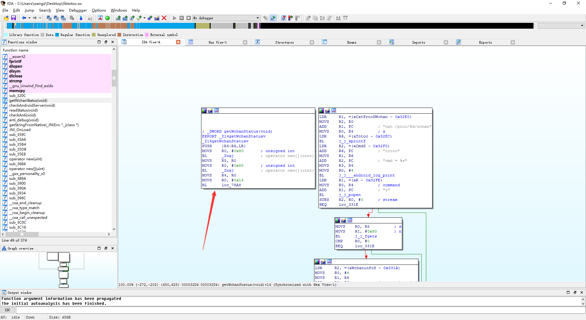

# 读取wchan反调试实现与逆向

**Author：wnagzihxain
Mail：tudouboom@163.com**

当程序被调试的时候，我们读取这个文件的数据和未被调试时的数据是不一样的

使用上一篇反调试所使用的的工程，跑起来，查看进程信息，选择PID为1321的那个
```
root@jflte:/ # ps |grep "wnagzihxain"
u0_a17    1321  283   940868 30472 ffffffff 400cc8e0 S com.wnagzihxain.myapplication
u0_a17    1357  1321  906420 11460 c00a30b4 400cc028 S com.wnagzihxain.myapplication
```

查看`/proc/1321/wchan`文件
```
root@jflte:/ # cat proc/1321/wchan
sys_epoll_waitroot@jflte:/ #
```

使用IDA attach PID为1321的进程

attach上之后，再查看`/proc/1321/wchan`文件
```
root@jflte:/ # cat proc/1321/wchan
ptrace_stoproot@jflte:/ #
```

根据这种情况，我们可以读取`/proc/1321/wchan`文件实现反调试

添加三个宏
```
#define WCHAN_ELSE 0;
#define WCHAN_RUNNING 1;
#define WCHAN_TRACING 2;
```

然后实现函数，记得在头文件添加定义，不然在`JNI_OnLoad()`是没法调用的
```
int getWchanStatus() {
    char *wchaninfo = new char[128];
    int result = WCHAN_ELSE;
    char *cmd = new char[128];
    pid_t pid = syscall(__NR_getpid);
    sprintf(cmd, "cat /proc/%d/wchan", pid);
    LOGI("cmd= %s", cmd);
    if (cmd == NULL) {
        return WCHAN_ELSE;
    }
    FILE *ptr;
    if ((ptr = popen(cmd, "r")) != NULL) {
        if (fgets(wchaninfo, 128, ptr) != NULL) {
            LOGI("wchaninfo = %s", wchaninfo);
        }
    }
    if (strncasecmp(wchaninfo, "sys_epoll\0", strlen("sys_epoll\0")) == 0) {
        result = WCHAN_RUNNING;
    }
    else if (strncasecmp(wchaninfo, "ptrace_stop\0", strlen("ptrace_stop\0")) == 0) {
        result = WCHAN_TRACING;
    }
    return result;
}
```

在`readStatus()`函数里添加调用
```
//LOGI("PID : %d", pid);
int ret = getWchanStatus();
if (2 == ret) {
    kill(pid, SIGKILL);
}
```

生成APK，解压出so文件，IDA载入，会发现多了一个函数的调用，这个就是`getWchanStatus()`方法
```
.text:0000341A BL      _Z14getWchanStatusv ; getWchanStatus(void)
.text:0000341E STR     R5, [SP,#0x128+var_124]
.text:00003420 CMP     R0, #2
.text:00003422 BNE     loc_342C
```

根据返回的结果跳转，如果返回2，跳转到kill分支`loc_342C`
```
.text:00003424 MOVS    R0, R4          ; pid
.text:00003426 MOVS    R1, #9          ; sig
.text:00003428 BL      j_j_kill
```

进入`getWchanStatus()`方法，会发现识别有问题，`Force BL call`就可以修复了



寄存器数据压栈
```
_Z14getWchanStatusv
PUSH    {R4-R6,LR}
```

将0x80赋值给R0，十进制是128：`R0 = 0x80`
```
MOVS    R0, #0x80       ; unsigned int
```

定义`uint`类型的数组，`uint->char`：`char xxx[0x80]`
```
BL      _Znaj           ; operator new[](uint)
```

R0此时是创建的数组首地址，赋值给R5，我们将其设为s1
```
MOVS    R5, R0
```

`R0 = 0x80`
```
MOVS    R0, #0x80       ; unsigned int
```

定义`uint`类型的数组，`uint->char`：`char xxx[0x80]`
```
BL      _Znaj           ; operator new[](uint)
```

R0此时是创建的数组首地址，赋值给R4，我们将其设为s2
```
MOVS    R4, R0
```

将`0x14`赋值给R0：`0x14`是`__NR_getpid`
```
MOVS    R0, #0x14       ; sysno
```

调用获取PID：`syscall(__NR_getpid)`
```
BL      j_j_syscall
```

将`aCatProcDWchan - 0x32E0`赋值给R1：`R1 = aCatProcDWchan - 0x32E0`
```
LDR     R1, =(aCatProcDWchan - 0x32E0)

```

上面调用完`j_j_syscall`之后，R0为PID
```
MOVS    R2, R0
```

重定位`aCatProcDWchan`，R1指向`"cat /proc/%d/wchan"`
```
ADD     R1, PC          ; "cat /proc/%d/wchan"
```

R4为创建的第二个字符数组首地址，赋值给R0：`R0 = s2`
```
MOVS    R0, R4          ; s
```

将`aTotoc - 0x32EC`赋值给R6：`R3 = aTotoc - 0x32EC`
```
LDR     R6, =(aTotoc - 0x32EC)
```

调用`sprintf()`函数：`sprintf(s2, "cat /proc/%d/wchan", PID)`
```
BL      j_j_sprintf
```

将`aCmdS - 0x32F0`赋值给R2：`R2 = aCmdS - 0x32F0`
```
LDR     R2, =(aCmdS - 0x32F0)
```

重定位完成后，R6指向`"totoc"`
```
ADD     R6, PC          ; "totoc"
```

将`"totoc"`的指针赋值给R1
```
MOVS    R1, R6
```

重定位完成，R2指向`"cmd = %s"`
```
ADD     R2, PC          ; "cmd = %s"
```

将R4赋值给R3，R4为创建的s数组首地址：`R3 = s2`
```
MOVS    R3, R4
```

将`0x4`赋值给R0：`R0 = 0x4`
```
MOVS    R0, #4
```

调用log，此时s为`"cat /proc/{PID}/wchan"`：`LOGI("cmd = %s", cmd)`
```
BL      j_j___android_log_print
```

将`aR - 0x32FE`赋值给R1：`R1 = aR - 0x32FE`
```
LDR     R1, =(aR - 0x32FE)
```

将R4也就是s数组的首地址赋值给R0，R0指向`"cat /proc/{PID}/wchan"`
```
MOVS    R0, R4          ; command
```

重定位完成，R1指向`"r"`
```
ADD     R1, PC          ; "r"
```

调用`popen()`方法，这个方法可以执行命令行，同时将显示的数据存到一个文件句柄里
```
BL      j_j_popen
```

此时R0存的就是返回的句柄，类型为`FILE *`
```

SUBS    R2, R0, #0      ; stream
BEQ     loc_331E
```

如果这里返回的值不为空

结合上面，这里还原一下代码：`fgets(s1, 128, R2)`
```
MOVS    R0, R5          ; s
MOVS    R1, #0x80       ; n
BL      j_j_fgets
```

判断返回的结果进行跳转
```
CMP     R0, #0
BEQ     loc_331E
```

如果返回的结果不为空，输出获取的数据
```
LDR     R2, =(aWchaninfoS - 0x331A)
MOVS    R0, #4
MOVS    R1, R6
ADD     R2, PC          ; "wchaninfo = %s"
MOVS    R3, R5
```

还原代码：`LOGI("wchaninfo = %s", s1)`
```
BL      j_j___android_log_print
```

上面是一个if代码块，这里开始是一个新的if-else结构

将`aSys_epoll - 0x3326`赋值给R4：`R4 = aSys_epoll - 0x3326`
```
loc_331E
LDR     R4, =(aSys_epoll - 0x3326)
```

将s1的指针赋值给R0
```
MOVS    R0, R5          ; s1
```

重定位完成，R4指向`"sys_epoll"`
```
ADD     R4, PC          ; "sys_epoll"
```

将s2的指针赋值给R1
```
MOVS    R1, R4          ; s2
```

将`0x9`赋值给R2：`R2 = 0x9`
```
MOVS    R2, #9          ; n
```

调用`strncasecmp()`，还原一下代码：`strncasecmp(s1, "sys_epoll\0", 9)`
```
BL      j_j_strncasecmp
```

将返回值赋值给R3
```
MOVS    R3, R0
```

将1赋值给R0：`R0 = 1`
```
MOVS    R0, #1
```

判断s1是否包含`"sys_epoll\0"`
```
CMP     R3, #0
```

如果包含，跳到结束分支，返回值为1
```
BEQ     locret_3346
```

如果不包含`"sys_epoll\0"`

将R4赋值给R1：`R1 = s2`
```
MOVS    R1, R4
```

将R5赋值给R0：`R0 = s1`
```
MOVS    R0, R5          ; s1
```

将s2往后加0xB个字节，什么意思呢？
```
ADDS    R1, #0xB        ; s2
```
网上找给s2赋值的地方`LDR     R4, =(aSys_epoll - 0x3326)`，双击进入`aSys_epoll`，看`"ptrace_stop\0"`刚好在`"sys_epoll"`偏移`0xB`的位置
```
.rodata:00008700 aSys_epoll      DCB "sys_epoll",0       ; DATA XREF: getWchanStatus(void)+62o
.rodata:00008700                                         ; .text:off_335Co ...
.rodata:0000870A                 DCB    0
.rodata:0000870B                 DCB 0x70 ; p
.rodata:0000870C                 DCB 0x74 ; t
.rodata:0000870D                 DCB 0x72 ; r
.rodata:0000870E                 DCB 0x61 ; a
.rodata:0000870F                 DCB 0x63 ; c
.rodata:00008710                 DCB 0x65 ; e
.rodata:00008711                 DCB 0x5F ; _
.rodata:00008712                 DCB 0x73 ; s
.rodata:00008713                 DCB 0x74 ; t
.rodata:00008714                 DCB 0x6F ; o
.rodata:00008715                 DCB 0x70 ; p
.rodata:00008716                 DCB    0
.rodata:00008717                 DCB    0
```

将`0xB`赋值给R2：`R2 = 0xB`
```
MOVS    R2, #0xB        ; n
```

还原一下代码：`strncasecmp(s1, "ptrace_stop\0", 0xB)`
```
BL      j_j_strncasecmp
```

然后根据返回结果决定返回值
```
NEGS    R3, R0
ADCS    R0, R3
LSLS    R0, R0, #1
```

静态分析完，我们动态调试一下

这里测试需要先生成APK，解压出so文件，提前在IDA下好断点
```
7775841A BL      _Z14getWchanStatusv ; getWchanStatus(void)
```

调试模式启动应用，输出LogCat
```
$ adb shell ps |grep "wnagzihxain"
u0_a137   10146 283   908004 18140 ffffffff 400ccaac S com.wnagzihxain.myapplication
$ adb logcat -v process |grep 10146
```

IDA attach，跑起来断在断点处，F7跟进去

F8单步走完这段最后一句
```
.text:77758310 LDR     R2, =(aWchaninfoS - 0x7775831A)
.text:77758312 MOVS    R0, #4
.text:77758314 MOVS    R1, R6
.text:77758316 ADD     R2, PC          ; "wchaninfo = %s"
.text:77758318 MOVS    R3, R5
.text:7775831A BL      j_j___android_log_print
```

LogCat记录
```
I(10146) cmd = cat /proc/10146/wchan  (totoc)
I(10146) wchaninfo = ptrace_stop  (totoc)
```

然后走完这个函数，跳出，发现R0的值为2
```
R0 00000002
```

一开始的宏定义
```
#define WCHAN_TRACING 2;
```

源码对应
```
int ret = getWchanStatus();
if (2 == ret) {
    kill(pid, SIGKILL);
}
```

F9，跑飞了

不过有个小问题，在单步的时候，有时候会读到0，不知道为什么
```
I(32081) wchaninfo = 0  (totoc)
```